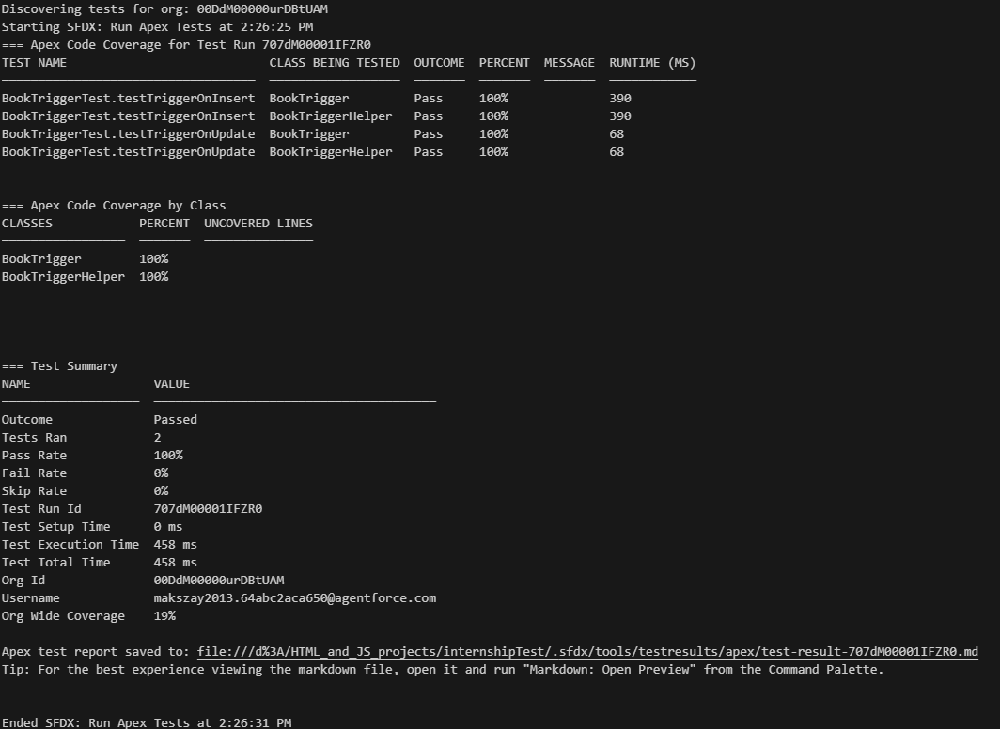
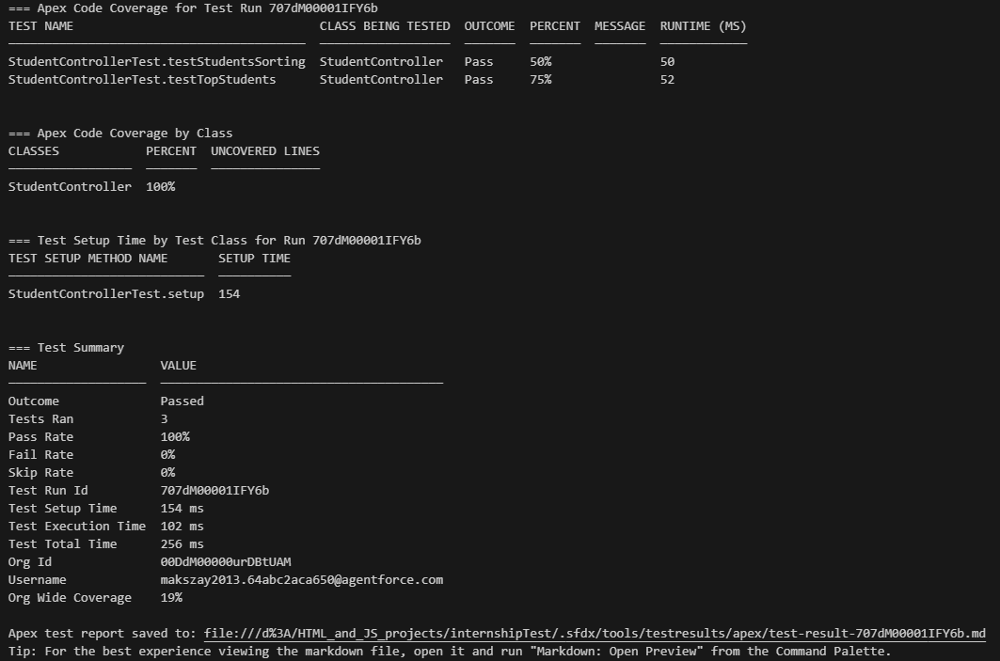

# Salesforce Internship Test

Tasks completed in this project: A and B

## Task A: Create Book object and trigger
Related components: BookTrigger, BookTriggerHelper, BookTriggerTest

- Created custom object 'Book__c' with fields 'Title', 'Price', 'Quantity', 'Available'
- Created trigger 'BookTrigger' before Insert and Update operations
- Created 'BookTriggerHelper' class as an implementation of helper pattern (replaced trigger logic to helper)
- Created 'BookTriggerTest' to test trigger on both insert and update operations. Reached 100% coverage

## Task B: Create controller class with SOQL queries
Related components: StudentController, StudentControllerTest

- Created custom class 'Student' with fields 'Name', 'Score' and 'Grade' (considered 'Grade' as literal grade based on score (e.g. F, D, C...))
- Created StudentController class with methods 'getStudents()' and 'getTopStudents(Integer studentsNumber)'
- Created 'StudentControllerTest' to test both methods of controller and used @TestSetup to setup test data before tests. Reached 100% coverage
